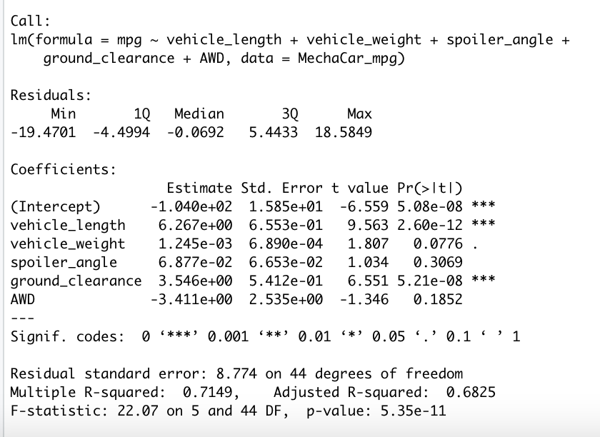

# Purpose

 To design a predictive, multiple linear regression modeling tool that predicts the mpg of MechaCar prototypes using several variables.

# Linear Regression to Predict MPG

### Which variables/coefficients provided a non-random amount of variance to the mpg values in the dataset?

Coefficients:

- Statistically significant, non-random amount of variance, where p-value < 0.05
    - y-intercept (other factors)
    - vehicle length
    - ground clearance

- Not statistically significant, random amount of variance, where p-value > .05
    - vehicle weight
    - spoiler angle
    - AWD

### Is the slope of the linear model considered to be zero? Why or why not?
- Null hypothesis: the hypothesis that can be explained by random chance. The slope of the linear model is zero, or m = 0. There is no significant linear relationship, each dependent value would be determined by random chance and error.
    - Assuming a significance level of 0.05%, the p-value of this linear model is 5.35e-11 and much smaller than our significance level. Therefore, we would state that there is sufficient statistical evidence that our null hypothesis is not true, and therefore we would reject our null hypothesis. That is why the slope of the linear model is not zero. 

### Does this linear model predict mpg of MechaCar prototypes effectively? Why or why not?
- Having an r-squared value of 0.71 means that there is a 71% chance this linear model will correctly predict the mpg of MechaCar prototypes. We can confirm that this multiple linear regression does predict mpg of the MechaCar prototypes effectively.

# Summary Statistics on Suspension Coils

The design specifications for the MechaCar suspension coils dictate that the variance of the suspension coils must not exceed 100 pounds per square inch. 

### Does the current manufacturing data meet this design specification for all manufacturing lots in total and each lot individually? Why or why not?

- In total, across all lots, the sample population of manufacturing lots has a suspension coil PSI variance of ~62.3, which is 37.7 % less than the max PSI variance requirement.

- However, when you look at them individually by lot number, Lot 3 is a large contributing factor to the variance being high. 
    - Lot 3 shows a variance of 170 > 100 and does not meet the design specifications. Lot 1 & 2 have significantly lower variance, 1 and 7 respectively.

## T-Tests on Suspension Coils

Population mean (mu) = 1500

Across all manufacturing lots:
- True mean = 1498.78
- P-value = 0.06028
    - Assuming significance level of 0.05, p-value > significance level. Therefore, we do not have sufficient evidence to reject our null hypothesis.

Sample sets:
- P-values:
    - lot 1 = 1
    - lot 2 = 0.6072
    - lot 3 = 0.04168
- Results:
    - Lot 1 & 2 have p-values that are greater than the significance level of 0.05. Therefore, we do not have sufficient evidence to reject our null hypothesis.  
        - Lot 1 & 2 show a normal distribution. They are not statistically different from the mean. 
        - The differences in mean from the population value for Lot 1 & 2 are likely due to chance
    - Lot 3 has a p-value that is less than significance level of 0.05. Therefore, there is sufficient statistical evidence that our null hypothesis is not true, and therefore we would reject our null hypothesis.
        - The sample population mean is statistically different to the population's mean.
        - Thus, the prototypes, specifically the suspension coils, should be closely reviewed moving forward since they do not meet quality assurance requirements.
    

# Design a Study Comparing the MechaCar to the Competition

## Purpose
Design a statistical study that can quantify how the MechaCar performs against the competition. Explore some metrics that would be of interest to a consumer. Examples of metrics: cost, city or highway fuel efficiency, horsepower, maintenance cost, or safety rating.

## Overview

### What metric or metrics are you going to test?
- Maintenance costs (dependent, continuous variable)
    - Assuming many consumers care about the cost of maintaining their asset, the cost is a major driver when it comes to deciding the next car to purchase.
- Miles drive (independent, categorical variable)
    - Catagorizing cars by established range of miles driven buckets
    - We assume that the more miles driven, the more maintenance will need to be contributed over time
- Manufacturer (independent, categorical variable)
    - MechaCar vs competitors

### What is the null hypothesis or alternative hypothesis?
- H0: The maintenance cost in which is related to miles driven and manufacturer are equal.
- Ha: The maintenance cost in which is NOT related to miles driven or manufacturer are not equal.

### What statistical test would you use to test the hypothesis? And why?
- ANOVA. We have more than 1 variable to test.
- We are trying to find out if there is a statistical difference between the distribution means from multiple samples.

### What data is needed to run the statistical test?
- A large sample size of cars from MechaCar and its competitors
- Miles driven per car.
    - Look at all cars serviced at MechaCar and its competitors
- Maintenance cost of car over time

